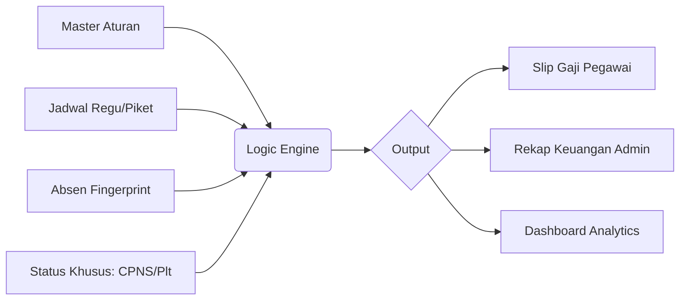

  
  
  # 🚀 Sinergi PAS v2.0
  ### Sistem Informasi Manajemen Kepegawaian & Payroll Terpadu
  **Lembaga Pemasyarakatan Kelas IIB Jombang**

  
  
  
  

---

## 📝 Tentang Proyek
**Sinergi PAS** adalah ekosistem digital internal Lapas Jombang yang menyinkronkan seluruh data kepegawaian (Profil, Jadwal, Absensi) menjadi sistem **Payroll Otomatis**. Proyek ini memastikan perhitungan Tunjangan Kinerja dan Uang Makan dilakukan secara transparan, akurat, dan sesuai dengan regulasi kementerian terbaru.

---

## ✨ Fitur Unggulan Terbaru

### 🛡️ 1. Smart Payroll Engine (Permenkumham 10/2021)
Sistem perhitungan akumulatif harian yang sangat presisi:
- 📈 **Status Khusus:** Kalkulasi otomatis untuk **CPNS (80%)**, **Tugas Belajar (Potong 100%)**, dan insentif **Plt/Plh (+20%)**.
- ⏱️ **Kompensasi Waktu:** Deteksi otomatis "Tebus Telat" sesuai aturan (Telat < 30m bisa diganti dengan pulang lebih lambat 30m).
- 📉 **Potongan Akumulatif:** Perhitungan TL 1-4, PSW, Mangkir harian, dan Sakit Progresif yang langsung memotong Pagu Bulanan.
- 🍱 **Uang Makan (PMK):** Sinkronisasi otomatis tarif per golongan berdasarkan kehadiran riil di hari kerja valid.

### ⚙️ 2. Master Aturan Dinamis (Control Center)
Admin memiliki kendali penuh melalui satu pintu:
- 🔧 **Custom Percentages:** Ubah persentase potongan TL/PSW/Mangkir tanpa menyentuh kode.
- ⏰ **Flexible Work Hours:** Atur jam masuk/pulang kantor secara global (mendukung jam khusus hari Jumat).
- 📅 **Quota Management:** Pengaturan kuota maksimal telat bulanan (Default: 8x).

### 👤 3. Employee Self-Service (Portal Mandiri)
Memberikan transparansi penuh kepada seluruh 109 pegawai:
- 💰 **Tunkin Saya:** Rincian estimasi gaji bulan berjalan, lengkap dengan daftar pelanggaran harian.
- 📱 **Monitor Absensi:** Pantau log scan fingerprint harian (Valid vs Luar Jadwal).
- 📂 **Digital Slip Gaji:** Unduh Slip Gaji resmi PDF yang diunggah Bendahara langsung dari dashboard.

### 📊 4. Admin & Analytics Dashboard
- 📈 **Real-time Monitoring:** Pantau kepatuhan dokumen dan statistik keterlambatan secara instan.
- 📑 **Official Reporting:** Export Rekapitulasi bulanan ke Excel atau PDF dengan Kop Surat Resmi Lapas Jombang.
- ⚡ **High-Performance Export:** Dioptimalkan untuk memproses ratusan data pegawai dalam hitungan detik (N+1 Query Optimized).

---

## 📜 Alur Kerja Terintegrasi

---

## 🛠️ Tech Stack & Optimization
- **Core:** Laravel 11, PHP 8.2, MySQL
- **Frontend:** Blade, Tailwind CSS, Lucide Icons, SweetAlert2
- **PDF Engine:** Barryvdh DomPDF (Optimized with Base64 Assets & Memory Boost)
- **Excel Engine:** Maatwebsite Excel
- **Timezone:** Asia/Jakarta (WIB)

---

## 👔 Identitas Satuan Kerja
**Kementerian Imigrasi dan Pemasyarakatan RI**
**Lembaga Pemasyarakatan Kelas IIB Jombang**
📍 Jl. KH. Wahid Hasyim No. 151, Jombang
📞 (0321) 861114

---

  Dibuat dengan ❤️ untuk Transformasi Digital Pemasyarakatan

